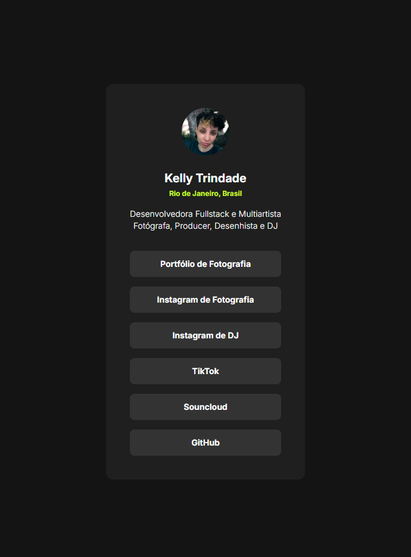
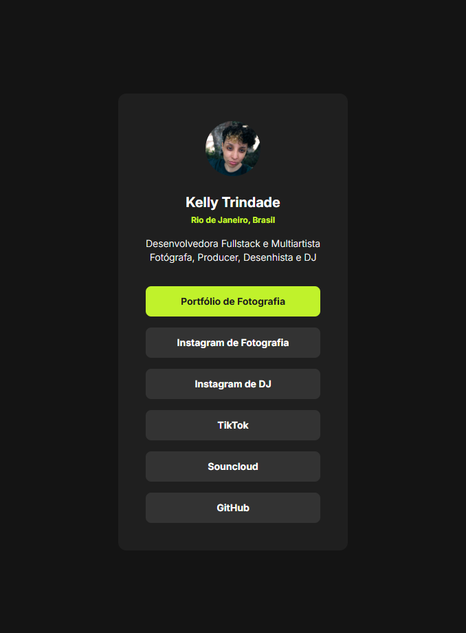

# Frontend Mentor - Social links profile

Este projeto é uma solução para o [desafio Social links profile do Frontend Mentor](https://www.frontendmentor.io/challenges/social-links-profile-UG32l9m6dQ).

## Overview

### O Desafio

Usuário pode interagir com os botões, acessando minhas demais plataformas.

Além de ser um desafio divertido de codar, o projeto será utilizado como meu próprio agregador de links nas minhas plataformas também.

### Screenshot

Painel de links ao passar o cursor do mouse sobre os botões

## Meu Processo

### Desenvolvido com

- [React](https://react.dev/)
- [Vite](https://vite.dev/)
- [Tailwind](https://tailwindcss.com/)

### Deploy
[Social links profile](https://ktrindade.netlify.app/)
